# Bài trình bày cuối khóa — Shopify app **Fit Confidence** (Size Finder)

> App đơn giản nhưng **thật và demo được**: rõ logic, rõ cách làm, có evidence chạy được. Repo được dựng theo mô hình **harness 5-subsystem** (xem `README.md`); app chạy *bên trong* harness đó. Toàn bộ vòng đời — từ tìm cơ hội thị trường đến code có kiểm chứng — áp dụng kiến thức khóa học.

---

## 1. Mục tiêu của app

**Vấn đề:** thời trang online đổi/trả ~30%, phần lớn do **chọn sai size**. Khách ngại đoán S hay M → bỏ giỏ hoặc mua rồi trả.

**App giải quyết:** widget **"Find my size"** trên trang sản phẩm — khách nhập chiều cao / cân nặng / kiểu mặc → app gợi ý **S/M/L/XL + lý do**, dựa trên **size chart merchant tự cấu hình** trong admin. Logic **rule-based, có unit test**, không "AI đoán", không gửi dữ liệu khách đi đâu.

**Định vị (từ phân tích đối thủ Kiwi Sizing):** Kiwi khóa recommender sau gói Plus + dán watermark ở gói Free. Fit Confidence đi ngược: **recommender miễn phí, không watermark, gọn** — hợp **merchant nhỏ** trong hệ sinh thái Omegatheme.

**Phạm vi (đủ 2 mặt một Shopify app thật):** storefront (Theme App Extension) **+** admin (embedded React Router app, trang Polaris sửa chart), nối nhau qua **app-owned metafield** (không cần database).

### Cách tìm ra app này (Phase 0 · research → cơ hội) — *evidence cho L1 + L2*

**Prompt research (role + constraint + exclusion)** — đây là prompt/context engineering, không hỏi chung chung:

> *"Bạn là **người làm sản phẩm có nhiều năm kinh nghiệm trên thị trường Shopify**. Hãy nghiên cứu thị trường và tìm các app **tăng conversion rate, giảm churn & return rate** nhưng **kiến trúc đơn giản**. Lưu ý: **không được giống** các app trong hệ sinh thái **Omegatheme**, mà phải **bổ trợ** được cho hệ sinh thái này."*

**Kết quả 1 — funnel 5 app cơ hội** (khảo sát **358K+ stores**): 40% stores chưa có retention tool · quiz conversion 25–40% (so 1.6% trung bình) · **98.1% stores thiếu analytics app**. Top đề xuất:

| App cơ hội | Tác động | Impact / Complexity |
|---|---|---|
| **① Size Finder & Fit Guide** | +CR · −Return | **Rất cao / Thấp** ← chọn |
| ② Back-in-Stock + Wishlist Alerts | +CR · −Churn | Cao / Thấp |
| ③ Post-Purchase Survey (NPS + Return Reason) | +Retention · −Return | Cao / Rất thấp |

**Kết quả 2 — deep-dive đối thủ** (prompt tiếp: *"phân tích khoảng trống Size Finder & Fit Guide + list app đang có trên Shopify App Store"*): **184+ app** trong category · market leader **Kiwi Sizing 42,977 installs** nhưng **−4% YoY (đang chững)** · fashion return **30% (1/4 do size)**. Kiwi: 4.8★ (1,037), Free–$24.49/mo, ML-based, AI *partial*, **không "Built for Shop"**.

→ **Quyết định chọn Size Finder:** impact rất cao + complexity thấp + **market leader đang chững và còn gap** (built-for-Shop, không watermark) → khe hở entry rõ. *Áp dụng kiến thức TỪ khâu chọn đề tài.*

---

## 2. Đã áp dụng kiến thức nào từ khóa học

| Kiến thức (buổi) | Áp dụng trong project | Evidence |
|---|---|---|
| **Prompt/Context Engineering** | Prompt research role; `docs/shopify-conventions.md` đóng gói domain knowledge cho agent | file conventions |
| **Planning + Delegation (skills)** | `/map-feature` ra dependency map đối thủ 31 feature → **cắt scope** về 4 hub; brainstorm → spec → plan có artifact | `outputs/kiwi-sizing-feature-map.html`, `docs/features/size-finder/{specs,plans}` |
| **CLAUDE.md / AGENTS.md** | AGENTS.md = entrypoint chuẩn (đa model); CLAUDE.md = operating loop cho Claude Code | repo root |
| **Hooks / Permissions / Guardrails** | hook chặn lệnh nguy hiểm + allow/ask/deny + pre-commit chặn secret + chống injection; **tự bảo vệ chính nó** | `.claude/`, `.githooks/pre-commit` |
| **TDD / Testing** | `recommendSize` (11 test) + `validateChart` (5) RED→GREEN; + test hành vi server (4) + regression (1) = **21 test** | `app/.../*.test.js` |
| **Verification** | `init.sh` chạy `npm test` + `shopify app build` + `verify-harness.sh` (artifact + schema + hook self-test) | `./init.sh` → **RESULT: PASS** |
| **Harness workflow** | `feature_list.json` (schema phân cấp, status/DoD/evidence/**risk**) + `claude-progress.md` + restartable | harness files |
| **MCP** | dùng **codegraph** (knowledge graph) + Shopify MCP skills validate GraphQL/Polaris vs schema | demo live `mcp__*` |
| **Subagent + Risk Matrix** | audit độ phủ kiến thức bằng **7 subagent song song**; custom agent `code-reviewer`; Risk Matrix máy enforce | `.claude/agents/`, `AGENTS.md` |

---

## 3. AI đã hỗ trợ phần nào

AI (Claude Code) hỗ trợ: **research** thị trường/đối thủ, **brainstorm** spec/plan, **generate** widget + trang admin, **viết test**, **debug**, và **tự audit** độ phủ kiến thức. **Tôi giữ vai PM + reviewer**: quyết hướng, chọn scope, review code, **dựng guardrails để AI không phá** và yêu cầu evidence trước khi nhận "done".

> Điểm nhấn: đây là **đổi vai coder → PM**. Một ví dụ ReAct loop điển hình: đọc stack trace → tìm root cause → sửa → chạy test xác nhận.

---

## 4. Kết quả đạt được

- **Chạy thật, demo được end-to-end** trên dev store `hieu-test-app-1`: sửa chart trong admin → Save (toast) → widget storefront đổi gợi ý.
- **Số liệu thật:** `npm test` **21/21** xanh · `shopify app build` OK · `react-router build` compile route admin · `./init.sh` → **RESULT: PASS**.
- **Đã deploy:** version **`fit-confidence-3`** (storefront widget chạy trên CDN Shopify, không cần server).
- App **gọn 3 màn**: Home (dashboard hướng dẫn), Size chart (editor), storefront widget.
- Lưu chart qua **app-owned metafield `$app:fit_confidence`** — không database.

🏷️ *Done = có evidence (commit + raw output `./init.sh`), không phải "AI nói xong".*

---

## 5. Khó khăn gặp phải & cách xử lý

1. **AI bịa công thức sizing** → khóa lại bằng **size chart thật + unit test** (test là hợp đồng).
2. **Metafield ownership / scope** (ca đắt nhất): thêm `write_metafields` → Shopify báo *"scope invalid"* (đã bị bỏ). Tra docs → hiểu **merchant-owned cần scope, app-owned `$app` thì không** → đổi sang reserved namespace `$app:fit_confidence`.
3. **3 bug bắt được khi demo live** (đọc lỗi → root cause → fix → regression test): query GraphQL bị `#` comment hết dòng; `document.currentScript` = null trong `<script type=module>`; theme-check lỗi vì literal `<script` trong comment JS.
4. **Skill design-prototype khóa vào Polaris/Admin** → không hợp storefront widget → nhận ra & **tự author** thay vì ép sai tool.
5. **codegraph trên app nhỏ là overkill** → **dùng có chọn lọc** (giá trị thật = blast-radius + flag test gap), không ép dùng tràn.

🏷️ *Systematic Debugging + chọn đúng tool + judgment (biết khi nào KHÔNG dùng tool nặng).*

---

## 6. Bài học rút ra

1. **Áp dụng kiến thức TỪ khâu chọn đề tài** — đọc dependency map đối thủ để cắt scope, không "làm app rồi mới nghĩ áp dụng gì".
2. **Plan kỹ + có test → AI nhanh và đáng tin hơn.** Test/verification là "hợp đồng" giữ AI đúng hướng.
3. **Harness + guardrails giữ AI không đi lạc / không phá** — hook tất định cho luật cứng, CLAUDE.md/AGENTS.md cho hướng dẫn.
4. **Done = evidence, không phải lời nói** — `./init.sh` PASS + commit history là minh chứng.
5. **Judgment quan trọng ngang công cụ** — biết *khi nào dùng* (và khi nào KHÔNG dùng) một tool/skill; tự kiểm chứng độ phủ thay vì tin tưởng.

---

## 7. Luồng build từ đầu → cuối (mỗi bước gắn Lesson)

> Câu chốt: *"Áp dụng kiến thức **theo đúng thứ tự vòng đời** — L1/L2 tìm cơ hội & scope, L4/L7 dựng nền an toàn TRƯỚC khi code, L3 xuyên suốt phần code, L5/L6 cho tooling & mở rộng — chứ không 'làm app xong mới gắn nhãn kiến thức'."*

### Sơ đồ (ASCII)

```
╔═══════════════════════════════════════════════════════════════════╗
║ PHASE 0 · TÌM CƠ HỘI & CẮT SCOPE                                   ║
╠═══════════════════════════════════════════════════════════════════╣
║  ① Research thị trường + tear-down đối thủ Kiwi      ──────► L1     ║
║       (prompt/context engineering, loại trừ nhiễu)                  ║
║              │                                                      ║
║  ② /map-feature → dependency map 31 feature                        ║
║       → CẮT SCOPE còn 4 hub (đọc độ phức tạp)        ──────► L2     ║
╚═══════════════════════════════╤═══════════════════════════════════╝
                                ▼
╔═══════════════════════════════════════════════════════════════════╗
║ PHASE 1 · DỰNG HARNESS + GUARDRAILS  (nền an toàn TRƯỚC khi code)  ║
╠═══════════════════════════════════════════════════════════════════╣
║  ③ AGENTS.md / CLAUDE.md / feature_list.json /                     ║
║       init.sh / claude-progress.md                  ──────► L7,L5  ║
║  ④ hooks chặn lệnh nguy hiểm + permissions +                       ║
║       pre-commit chặn secret + chống injection      ──────► L4     ║
║  ⑤ init.sh chạy verify-harness                                     ║
║       (artifact + JSON schema + hook self-test)     ──────► L3,L7  ║
╚═══════════════════════════════╤═══════════════════════════════════╝
                                ▼
╔═══════════════════════════════════════════════════════════════════╗
║ PHASE 2 · DESIGN  (artifact bền, không chat)                      ║
╠═══════════════════════════════════════════════════════════════════╣
║  ⑥ brainstorm → spec → plan (+ prototype UI)        ──────► L2,L5  ║
╚═══════════════════════════════╤═══════════════════════════════════╝
                                ▼
╔═══════════════════════════════════════════════════════════════════╗
║ PHASE 3 · BUILD STOREFRONT  (Size Finder widget)                  ║
╠═══════════════════════════════════════════════════════════════════╣
║  ⑦ recommendSize()  RED → GREEN → REFACTOR          ──────► L3 ⭐  ║
║       (TDD: exact / validation / out-of-range / fit)               ║
║  ⑧ theme app block + modal UI (ReAct loop)          ──────► L7,L1 ║
║  ⑨ shopify app build OK → deploy fit-confidence-1   ──────► L7     ║
╚═══════════════════════════════╤═══════════════════════════════════╝
                                ▼
╔═══════════════════════════════════════════════════════════════════╗
║ PHASE 4 · BUILD ADMIN  (embedded app + metafield)                 ║
╠═══════════════════════════════════════════════════════════════════╣
║  ⑩ codegraph: index → explore (HIỂU trước khi extend)──────► L2,L6 ║
║  ⑪ shopify app init → embedded React Router app                    ║
║       → gộp về app/ (1 app = storefront + admin)    ──────► L7     ║
║  ⑫ validateChart()  RED → GREEN                     ──────► L3 ⭐  ║
║  ⑬ trang Polaris + app-owned metafield $app:                       ║
║       GraphQL/Polaris validate qua MCP skills       ──────► L6,L5  ║
║  ⑭ DEBUG: scope invalid + 3 bug live                               ║
║       (reproduce → root cause → fix → regression)   ──────► L3 ⭐  ║
║  ⑮ deploy fit-confidence-2 → DEMO LIVE end-to-end   ──────► L3,L7  ║
╚═══════════════════════════════╤═══════════════════════════════════╝
                                ▼
╔═══════════════════════════════════════════════════════════════════╗
║ PHASE 5 · POLISH + QUALITY LOOP                                   ║
╠═══════════════════════════════════════════════════════════════════╣
║  ⑯ Home dashboard + theme-editor deep link          ──────► L5,L7 ║
║  ⑰ codegraph FLAG test gap → đóng bằng 4 test                      ║
║       (vòng lặp tool → action)                      ──────► L6,L3  ║
║  ⑱ AUDIT coverage: 7 subagent SONG SONG (1/lesson)  ──────► L2,L5 ║
║  ⑲ đóng gap: code-reviewer agent · Risk Matrix ·                   ║
║       session-handoff (máy enforce risk)            ──────► L5,L3,L7║
╚═══════════════════════════════╤═══════════════════════════════════╝
                                ▼
                  ┌───────────────────────────────┐
                  │  XUYÊN SUỐT (mọi phase):       │
                  │  • externalize state → file    │ ► L7
                  │  • verify trước, commit theo    │ ► L3
                  │    nhịp, evidence ≠ lời nói      │
                  │  • 1 feature/lần, không overreach│ ► L7
                  └───────────────────────────────┘
```

### Sơ đồ (Mermaid — dán vào slide/Notion để render)

```mermaid
flowchart TD
    subgraph P0["PHASE 0 · Cơ hội & Scope"]
      A1["① Research + tear-down Kiwi<br/>(L1 prompt/context)"]
      A2["② /map-feature → cắt scope 4 hub<br/>(L2 planning/delegation)"]
    end
    subgraph P1["PHASE 1 · Harness + Guardrails"]
      B1["③ AGENTS/CLAUDE/feature_list/init.sh<br/>(L7,L5)"]
      B2["④ hooks + permissions + pre-commit secret<br/>(L4)"]
      B3["⑤ init.sh → verify-harness<br/>(L3,L7)"]
    end
    subgraph P2["PHASE 2 · Design"]
      C1["⑥ brainstorm → spec → plan + prototype<br/>(L2,L5)"]
    end
    subgraph P3["PHASE 3 · Storefront widget"]
      D1["⑦ recommendSize RED→GREEN<br/>(L3 TDD)"]
      D2["⑧ theme app block + UI<br/>(L7,L1)"]
      D3["⑨ deploy fit-confidence-1<br/>(L7)"]
    end
    subgraph P4["PHASE 4 · Admin embedded"]
      E1["⑩ codegraph hiểu code trước extend<br/>(L2,L6)"]
      E2["⑪ shopify app init → React Router, gộp app/<br/>(L7)"]
      E3["⑫ validateChart RED→GREEN<br/>(L3)"]
      E4["⑬ Polaris + app-owned metafield, MCP validate<br/>(L6,L5)"]
      E5["⑭ debug scope + 3 bug live<br/>(L3)"]
      E6["⑮ deploy v2 + demo live<br/>(L3,L7)"]
    end
    subgraph P5["PHASE 5 · Polish + Quality loop"]
      F1["⑯ Home dashboard + deep link<br/>(L5,L7)"]
      F2["⑰ codegraph flag gap → đóng test<br/>(L6,L3)"]
      F3["⑱ audit 7 subagent song song<br/>(L2,L5)"]
      F4["⑲ code-reviewer + Risk Matrix + handoff<br/>(L5,L3,L7)"]
    end
    A1-->A2-->B1-->B2-->B3-->C1-->D1-->D2-->D3-->E1-->E2-->E3-->E4-->E5-->E6-->F1-->F2-->F3-->F4
```



### Cheat-sheet — Lesson dùng ở bước nào (để chỉ tay khi thuyết trình)

| Lesson | Xuất hiện ở bước |
|---|---|
| **L1** Context Eng | ①, ⑧ |
| **L2** Planning/Delegation | ②, ⑥, ⑩, ⑱ |
| **L3** TDD/Verify/Debug | ⑤, ⑦, ⑫, ⑭, ⑮, ⑰, ⑲ ⭐ (nhiều nhất) |
| **L4** Guardrails/Hooks | ④ |
| **L5** Skills/CLAUDE/Subagent | ③, ⑥, ⑬, ⑯, ⑱, ⑲ |
| **L6** MCP | ⑩, ⑬, ⑰ |
| **L7** Harness/Cross-model | ③, ⑤, ⑧, ⑨, ⑪, ⑮, ⑯, ⑲ |

---

### Phụ lục — cách demo live (gợi ý 2–3 phút)
1. `git log --oneline` + chạy `./init.sh` → cho xem **RESULT: PASS** (21/21).
2. Admin → **Size chart** → sửa 1 dải của M → **Save** (toast). Thử Save sai (min>max) → banner đỏ.
3. Storefront → **Find my size** → nhập số đo → ra size + lý do; nhập số đo biên → đổi theo chart vừa sửa.
4. (tùy chọn) `codegraph_explore` 1 call cho thấy blast-radius — minh họa "context tool".

> Cần `shopify app dev` chạy để màn **admin** load (App URL = tunnel); storefront widget thì chạy độc lập trên CDN.
